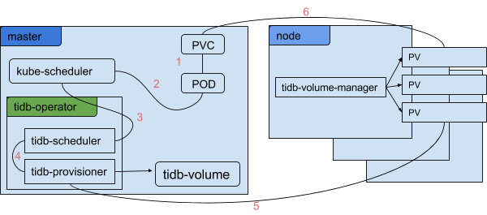

## Overview

[](http://107.150.122.206:32323/job/build_operator_master/)

The TiDB operator manages TiDB clusters deployed to [Kubernetes](https://kubernetes.io) and automates tasks related to operating a TiDB cluster.

- [Deploying the TiDB operator](#deploying-the-tidb-operator)
- [Managing TiDB volumes](#managing-tidb-volumes)
- [Creating a TiDB cluster](#creating-a-tidb-cluster)
- [Resizing and rolling update the cluster](#resizing-and-rolling-update-the-cluster)
- [Scheduling](#scheduling)
- [Design](#design)

## Deploying the TiDB operator

The TiDB operator is composed of tidb-scheduler, tidb-operator, tidb-volume-manager

Deploy the TiDB operator:

```
kubectl apply -f example/tidb-operator.yaml
```

The TiDB operator automatically creates the following components:

```
# kubectl get daemonset --namespace=kube-system --selector "app=tidb-operator"
NAME                  DESIRED   CURRENT   READY     UP-TO-DATE   AVAILABLE   NODE-SELECTOR   AGE
tidb-volume-manager   9         9         9         9            9           <none>          1m

# kubectl get deployment --namespace=kube-system --selector "app=tidb-operator"
NAME             DESIRED   CURRENT   UP-TO-DATE   AVAILABLE   AGE
tidb-operator    1         1         1            1           1m
tidb-scheduler   1         1         1            1           1m

# kubectl get configmap --namespace=kube-system --selector "app=tidb-operator"
NAME                    DATA      AGE
tidb-scheduler-policy   1         3m

# kubectl get thirdpartyresource
NAME                       DESCRIPTION      VERSION(S)
tidb-cluster.pingcap.com   TiDB Cluster     v1
tidb-set.pingcap.com       TiDB component   v1
```

## Managing TiDB volumes

With Kubernetes, you can use [Requests and Limits](https://github.com/kubernetes/community/blob/master/contributors/design-proposals/resource-qos.md) to achieve CPU and memory isolation, but it is very hard to achieve storage isolation in Kubernetes natively.

So `tidb-provisioner` is added to Kubernetes as a HostPath based [PersistentVolume provisioner](https://kubernetes.io/docs/concepts/storage/persistent-volumes/#provisioner).

Before you create the first TiDB cluster, create a `tidb-volume` [ConfigMap](https://kubernetes.io/docs/tasks/configure-pod-container/configmap):

```
kubectl create -f example/tidb-volume.yaml
```

Each directory here can only be mounted by one `TiKV` instance at a time, and **for the best IO performance and the best isolation effect, you must mount one device to one directory only**.

## Creating a TiDB cluster

After deploying the TiDB operator, you can use the following command to create a TidbCluster object which is a [ThirdPartyResource](https://kubernetes.io/docs/tasks/access-kubernetes-api/extend-api-third-party-resource) in Kubernetes.

```
# kubectl create -f example/demo-cluster.yaml
```

You can adjust some attributes in the `demo-cluster.yaml` file to meet your requirements.

Wait a few minutes to get all TiDB components running:

```
# kubectl get pod --selector "cluster.pingcap.com/tidbCluster=demo-cluster"
NAME                      READY     STATUS    RESTARTS   AGE
demo-cluster-pd-23tvs     1/1       Running   0          4m
demo-cluster-tidb-lt76v   1/1       Running   0          1m
demo-cluster-tidb-pqpkv   1/1       Running   0          1m
demo-cluster-tikv-fncsh   1/1       Running   0          4m
demo-cluster-tikv-k3dg5   1/1       Running   0          3m
demo-cluster-tikv-pjpp5   1/1       Running   0          4m

# kubectl get service --selector "cluster.pingcap.com/tidbCluster=demo-cluster"
NAME                CLUSTER-IP     EXTERNAL-IP   PORT(S)    AGE
demo-cluster-pd     10.233.53.41   <none>        2379/TCP   5m
demo-cluster-tidb   10.233.43.14   <none>        4000/TCP   5m
```

## Resizing and rolling update the cluster

1. Edit the `demo-cluster` object which is created in the last section to change the number of `pd` replicas to 3, and change the number of `tikv` replicas to 5:

```
# vim example/demo-cluster.yaml
```

2. Use the following command to update the object.

```
# kubectl apply -f example/demo-cluster.yaml
```

3. Wait a few minutes and then the number of `pd` and `tikv` instances are updated:

```
# kubectl get pod -selector "cluster.pingcap.com/tidbCluster=demo-cluster"
NAME                      READY     STATUS              RESTARTS   AGE
demo-cluster-pd-23tvs     1/1       Running             0          8m
demo-cluster-pd-qf3w8     1/1       Running             0          2m
demo-cluster-pd-wp0hp     1/1       Running             2          2m
demo-cluster-tidb-lt76v   1/1       Running             0          5m
demo-cluster-tidb-pqpkv   1/1       Running             0          5m
demo-cluster-tikv-fncsh   1/1       Running             0          8m
demo-cluster-tikv-k3dg5   1/1       Running             0          8m
demo-cluster-tikv-pjpp5   1/1       Running             0          8m
demo-cluster-tikv-pvrbw   1/1       Running             0          2m
demo-cluster-tikv-t7067   1/1       Running             0          2m
```

Use the same procedure for rolling upgrade.

## Scheduling

Comming soon ...

## Design



The TiDB operator consists of the following components:

### tidb-operator

`tidb-opertor` is the main component of the TiDB operator. Its job is to watch all the `tidbclusters` resources created by the user, and then create/delete/update TidbSet of all TiDB components according to the specifications in the `.yaml` of `TidbCluster` object.

### tidb-scheduler

`tidb-scheduler` is a [Kubernetes scheduler extender](https://github.com/kubernetes/community/blob/master/contributors/design-proposals/scheduler_extender.md) to schedule `TiKV`.

### tidb-provisioner

`tidb-provisioner` is HostPath based PersistentVolume provisioner.

### tidb-volume-manager

`tidb-volume-manager` is responsible for deleting the [PersistentVolumes(PVs)](https://kubernetes.io/docs/concepts/storage/persistent-volumes) released by the TiDB operator.

### TiDB operator workflow

1. Create a [PersistentVolumeClaims(PVC)](https://kubernetes.io/docs/concepts/storage/persistent-volumes).

2. Create a `TiKV` pod.

3. `kube-scheduler` selects some nodes suitable for this pod and sends these nodes to `tidb-scheduler`.

4. `tidb-scheduler` tries to find a node with available `HostPath` based `PV`s, which are supplied by `tidb-provisioner`.

5. `tidb-provisioner` creates a `PV` related to `PVC` for `tidb-scheduler`.

6. At the end, the `TiKV` pod is scheduled to a suitable node, and next Kubernetes inspects the `PVC` to find the bound `PV` and mounts that volume for the `TiKV` pod.
